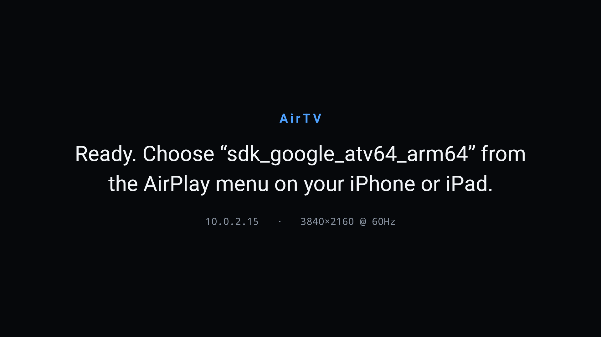

# AirTV — AirPlay receiver for Google TV / Android TV

Mirror your iPhone or iPad screen (with audio) to a Google TV or Android TV device over
AirPlay. Open the app on the TV, pick the TV in the iOS Screen Mirroring menu, done — no
pairing code, no account, no cloud.



**Just want it on your TV?** See
[Install straight on the TV](#install-straight-on-the-tv-no-computer) — no computer, no
developer mode.

## Install straight on the TV (no computer)

The TV downloads the APK from GitHub itself.

1. On the TV, install **Downloader** (by AFTVnews) from the Google Play Store.
2. Allow it to install apps: **Settings → Apps → Security & restrictions → Install unknown
   apps → Downloader → on**. On Google TV the path is **Settings → Privacy → Apps → Special
   app access → Install unknown apps → Downloader → on**.
3. Open Downloader and enter this URL (it always points at the newest release):

   ```
   https://github.com/0xb1ob/air-tv/releases/latest/download/AirTV.apk
   ```

4. It downloads, then asks to install — choose **Install**, then **Done**, and delete the
   downloaded file when Downloader offers to.
5. Launch **AirTV** from the apps row on the home screen.

To update later, repeat with the same URL; installing over the top keeps your pairing.

> Releases are built by GitHub Actions from a `v*` tag — see
> [`.github/workflows/release.yml`](.github/workflows/release.yml). All releases are on the
> [Releases page](https://github.com/0xb1ob/air-tv/releases), and `dist/AirTV.apk` in
> this repo is a committed copy of the current build.

## Build from source

**Requirements**

- **JDK 17** (`java -version` should say 17.x). Newer JDKs will not work with this AGP.
- **Android SDK** with platform 34, build-tools 34, **NDK 26.1.10909125** and CMake 3.22.1.
- Nothing else: the native C dependencies are cross-compiled already and committed under
  `app/src/main/cpp/prebuilt/`, so you do not need OpenSSL, libplist or autotools.

If you have Android Studio, install those components in **SDK Manager → SDK Tools** (tick
"Show Package Details" to pick the exact NDK version). To set it up from a terminal instead:

```bash
# macOS example; on Linux use commandlinetools-linux-*.zip and ~/Android/Sdk
export ANDROID_HOME="$HOME/Library/Android/sdk"
mkdir -p "$ANDROID_HOME/cmdline-tools"
curl -L -o clt.zip https://dl.google.com/android/repository/commandlinetools-mac-11076708_latest.zip
unzip -q clt.zip && mv cmdline-tools "$ANDROID_HOME/cmdline-tools/latest"

export PATH="$ANDROID_HOME/cmdline-tools/latest/bin:$ANDROID_HOME/platform-tools:$PATH"
yes | sdkmanager --licenses
sdkmanager "platform-tools" "platforms;android-34" "build-tools;34.0.0" \
           "ndk;26.1.10909125" "cmake;3.22.1"
```

**Build**

```bash
git clone https://github.com/0xb1ob/air-tv.git
cd air-tv
echo "sdk.dir=$HOME/Library/Android/sdk" > local.properties   # your SDK path

./gradlew assembleRelease
# -> app/build/outputs/apk/release/app-release.apk
```

The first build takes a few minutes: it compiles the vendored AirPlay C library for three
ABIs (`arm64-v8a`, `armeabi-v7a`, `x86_64`). Use `./gradlew assembleDebug` while developing.

A plain local build is signed with your machine's Android debug key, which is fine for
testing. Published releases are signed with a stable key so that each one installs as an
update over the last (see [Releases and signing](#releases-and-signing)). To build a
release-signed APK yourself:

```bash
./gradlew assembleRelease \
  -PsigningKeystore=$PWD/airtv-release.jks \
  -PsigningKeystorePassword=<password> \
  -PsigningKeyAlias=airtv
```

To refresh the committed native dependencies (OpenSSL 3.0.16, libplist 2.6.0) — only needed
if you want to bump their versions:

```bash
NDK_ROOT=$ANDROID_HOME/ndk/26.1.10909125 tools/build-native-deps.sh
```

## Install on your TV

**1. Enable debugging on the TV.** Settings → System → About → tap **"Android TV OS build"
seven times** to unlock developer options. Then Settings → System → **Developer options** →
turn on **USB debugging** and **Network debugging** (called "Wireless debugging" on some
sets). Note the TV's IP address under Settings → Network.

**2. Connect and install** from your computer:

```bash
adb connect 192.168.1.50:5555     # your TV's IP — accept the prompt shown on the TV
adb install -r dist/AirTV.apk     # or app/build/outputs/apk/release/app-release.apk
```

**3. Launch AirTV** from the Android TV home screen — it appears in the apps row with its
own banner. (First launch can also be triggered from the terminal:
`adb shell am start -n com.airtv.receiver/.ui.MainActivity`.)

There is a helper that does install + launch + log tailing in one go, which is the easiest
way to see what is happening during a mirroring test:

```bash
tools/run-on-device.sh                  # uses the already-connected device
tools/run-on-device.sh 192.168.1.50     # connects first
```

**Notes**

- After the TV reboots you need `adb connect <tv-ip>:5555` again.
- `adb: device unauthorized` means the confirmation dialog on the TV was missed — run
  `adb connect` again and accept it (tick "always allow").
- Installing over an older copy keeps your pairing; `adb uninstall com.airtv.receiver`
  removes the app and its stored pairing key.

## Using it

1. Open AirTV on the TV. It shows `Ready. Choose "<TV name>" …` plus its IP and display mode.
2. On the iPhone/iPad: swipe down from the top-right corner → **Screen Mirroring** → pick
   your TV.
3. The TV switches to your device's screen, with audio.

Both devices must be on the same network, and the network must allow multicast (mDNS) and
direct device-to-device traffic. Guest/AP-isolated Wi-Fi networks will not work.

The receiver keeps running while the app is in the background, so audio continues if you
switch away; press **Back** on the TV remote to exit and stop it.

## About resolution

The receiver advertises your panel's real mode — verified at **3840×2160 @ 60 Hz** on a 4K
display. The decoder produces frames at the stream's own resolution and the compositor
scales them into the video rectangle, so nothing is scaled twice; the decode path handles
H.264 and H.265 up to whatever your TV's decoder supports, which is 4K on current Google TV
hardware.

The picture keeps the sender's aspect ratio: a portrait iPhone is pillarboxed (black bars
left and right), a 16:9 Mac fills the screen. The rectangle is derived from the decoder's
own output geometry — crop rectangle included — rather than the size the sender announces,
and it follows mid-session changes such as rotating the phone.

The idle screen shows the mode it detected. If a 4K TV reports `1920×1080`, that is usually
correct rather than a bug: many Android TVs (e.g. MediaTek mt5889 sets) composite the whole
UI at 1080p and let the panel's own scaler upscale, exposing only 1080p modes to apps —
`sys.display-size` says `3840x2160` while Android's `supportedModes` lists 1080p only. 4K on
those sets is reachable only through the separate hardware video plane, not a graphics
surface. The app advertises the largest mode the platform offers, so a device that does
expose 3840×2160 gets it with no change.

What the stream actually arrives at is **iOS's decision, not the receiver's**: for screen
mirroring iOS picks the encode resolution itself and in practice caps it at 1080p
(sometimes lower, and it drops resolution when the network is congested). No receiver
implementation can raise that cap. So: 4K-capable pipeline, 1080p-ish real-world mirroring
of an iPhone screen. This app does not implement the separate AirPlay-video (HLS) path that
apps like YouTube use to hand off a 4K stream directly.

## Use Screen Mirroring, not the AirPlay button inside apps

iOS has two different AirPlay protocols, and this app implements the mirroring one:

| How you start it | What iOS sends | Result here |
| --- | --- | --- |
| Control Centre → **Screen Mirroring** | mirroring: H.264 + AAC-ELD | video and audio on the TV |
| **AirPlay icon inside a video player** (Chrome, Safari, most apps) | audio-only ALAC — video stays on the phone | TV explains it is audio-only; ALAC itself is not decoded, so it is silent |
| AirPlay icon in the **YouTube app** | HLS hand-off (`_airplay` video protocol) | not implemented |

To watch a web video on the TV, start Screen Mirroring first, then play the video
fullscreen — the picture and sound both travel over the mirroring stream.

The AirPlay-video/HLS path is deliberately not advertised. Upstream UxPlay supports it only
for the YouTube app — "streaming using the AirPlay icon in a browser window is not yet
supported" — so enabling it would not fix the browser case, and it would divert other video
content away from the mirroring path that does work.

## Audio

| Sender | Codec | Supported |
| --- | --- | --- |
| Screen mirroring (iPhone/iPad) | AAC-ELD 44.1 kHz stereo | yes |
| Some senders / AirPlay audio | AAC-LC | yes |
| Audio-only AirPlay (Music app, in-app AirPlay buttons) | ALAC | no — Android has no guaranteed ALAC decoder |

## How it works

```
iPhone ──mDNS/Bonjour──▶ _airplay._tcp + _raop._tcp   (embedded mDNS responder)
       ──RTSP──────────▶ pair-setup / fp-setup / SETUP (FairPlay, Ed25519/Curve25519)
       ──RTP───────────▶ H.264 access units + AAC-ELD frames (AES encrypted)
                             │
                    airplay_jni.c (JNI bridge)
                             │
              VideoPipeline ─┴─ AudioPipeline
              MediaCodec →      MediaCodec →
              SurfaceView       AudioTrack
```

- `app/src/main/cpp/airplay/` — the AirPlay protocol server, vendored from
  [UxPlay](https://github.com/FDH2/UxPlay) (`lib/`, plus its bundled `playfair`, `llhttp`
  and `mdnsd`). This is the mature, actively maintained implementation of the FairPlay
  handshake and RTP/mirror protocol; reimplementing it would mean reproducing
  reverse-engineered FairPlay key tables.
- `app/src/main/cpp/airplay_jni.c` — bridges the library's `raop_callbacks_t` to Kotlin,
  handing up Annex-B video and AAC audio via direct `ByteBuffer`s, and normalising the
  remote NTP clock to presentation timestamps.
- `app/src/main/cpp/prebuilt/` — static `libcrypto` (OpenSSL 3.0.16) and `libplist` 2.6.0
  cross-compiled for `arm64-v8a`, `armeabi-v7a` and `x86_64`. Refresh with
  `tools/build-native-deps.sh`.
- `app/src/main/java/com/airtv/receiver/` — Kotlin: MediaCodec pipelines, the foreground
  service that owns the server and the multicast lock, and the full-screen activity.

## Tests

```bash
./gradlew test                      # 49 JVM unit tests
./gradlew connectedAndroidTest      # 29 instrumented tests (needs a device/emulator)
```

The instrumented tests are the interesting ones: they boot the real native server and
speak RTSP to it over a socket, send real multicast DNS queries and assert the responder
answers for both services, and push a genuine H.264 stream (produced by the platform
encoder) through the decode pipeline onto a real surface — reshaped the way AirPlay actually
delivers it, with the parameter sets prepended to a keyframe rather than sent on their own.
That reshaping matters: testing against the encoder's raw output hides a bug that makes a
real iPhone show a black screen.

Not covered automatically: a real iPhone completing the FairPlay handshake. That needs an
actual device on the network.

## Releases and signing

Tagging `vX.Y.Z` and pushing the tag runs
[`.github/workflows/release.yml`](.github/workflows/release.yml), which runs the unit
tests, builds the APK with the version taken from the tag, and publishes it as
`AirTV.apk` on the Releases page:

```bash
git tag -a v1.0.1 -m "AirTV 1.0.1"
git push origin v1.0.1
```

(The workflow can also be started by hand from the Actions tab with a version number.)

Releases are signed with a **stable key**, not the throwaway debug key that Android
generates per machine — otherwise no release could be installed over the previous one.
The workflow reads it from three repository secrets:

| Secret | Contents |
| --- | --- |
| `SIGNING_KEYSTORE_BASE64` | `base64 airtv-release.jks`, single line |
| `SIGNING_KEYSTORE_PASSWORD` | keystore/key password |
| `SIGNING_KEY_ALIAS` | `airtv` |

The keystore itself is deliberately **not** in the repo (it is in `.gitignore`). Keep
`airtv-release.jks` and its password somewhere safe: if that key is lost, no future build
can be installed as an update over an existing one — every user would have to uninstall
first, losing their AirPlay pairing.

The workflow fails rather than falling back to a debug key if the secret is missing, so a
release can never be published with an unstable identity.

## Licence

GPLv3 — see `LICENSE`. The vendored UxPlay library is LGPL-2.1+ and its bundled `playfair`
component is GPLv3, which makes the combined work GPLv3.
